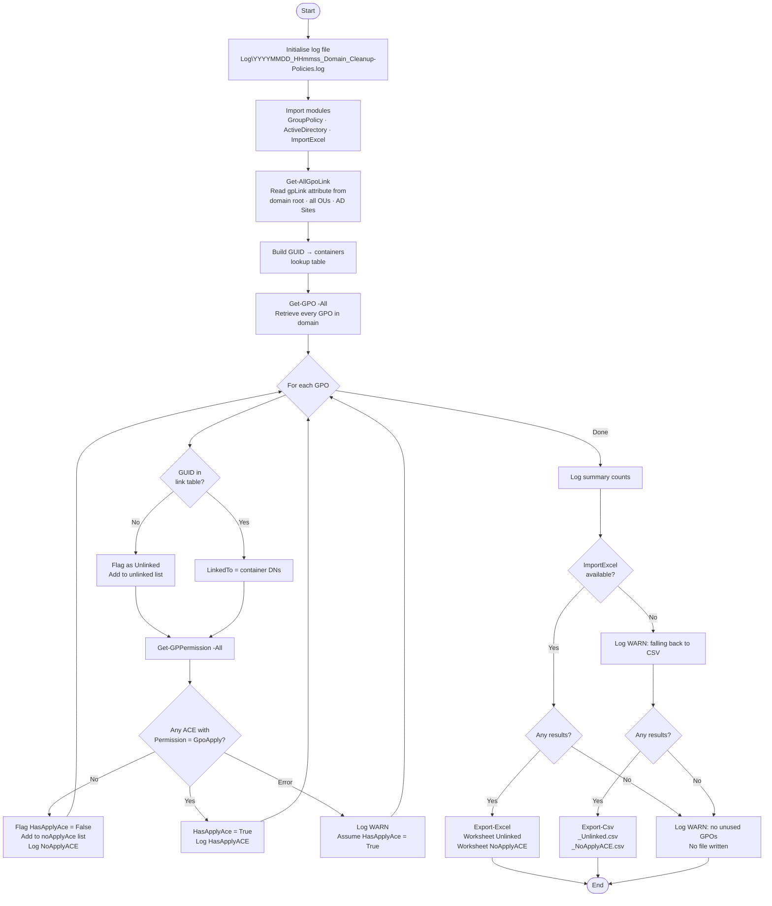

# Cleanup-Policies.ps1

Inventories Group Policy Objects (GPOs) in an Active Directory domain that are
either **unlinked** (not applied to any OU, site or domain container) or have
**no 'Apply Group Policy' Allow ACE** in their security descriptor, making them
effectively dead policies.

## Synopsis

```powershell
.\Cleanup-Policies.ps1 [-Domain <string>] [-OutputPath <string>]
```

## Parameters

| Parameter | Type | Required | Default | Description |
| --- | --- | --- | --- | --- |
| `Domain` | String | No | `$env:USERDNSDOMAIN` | FQDN of the AD domain to query |
| `OutputPath` | String | No | Script directory | Directory where the report is written |

## Output

| File | When | Description |
| --- | --- | --- |
| `YYYY-MM-dd_<Domain>_Get-UnusedGPOs.xlsx` | ImportExcel available | Two-worksheet workbook |
| `YYYY-MM-dd_<Domain>_Get-UnusedGPOs_Unlinked.csv` | Fallback | Unlinked GPOs only |
| `YYYY-MM-dd_<Domain>_Get-UnusedGPOs_NoApplyACE.csv` | Fallback | GPOs without Apply ACE |
| `Log\YYYYMMDD_HHmmss_<Domain>_Cleanup-Policies.log` | Always | Timestamped run log |

### Report columns

| Column | Description |
| --- | --- |
| `GPOName` | Display name of the GPO |
| `GPOId` | GUID in `{…}` notation |
| `GpoStatus` | AllSettingsEnabled / Disabled / UserSettingsDisabled / ComputerSettingsDisabled |
| `CreationTime` | When the GPO was created |
| `ModificationTime` | When the GPO was last modified |
| `LinkedTo` | Semicolon-separated list of container DNs (blank = unlinked) |
| `IsUnlinked` | `True` when the GPO has no links |
| `HasApplyAce` | `False` when no Allow 'Apply Group Policy' ACE exists |

## Requirements

| Requirement | Details |
| --- | --- |
| PowerShell | 5.1 or 7+ |
| RSAT — Group Policy | `GroupPolicy` module (`RSAT-GPMC`) |
| RSAT — Active Directory | `ActiveDirectory` module (`RSAT-AD-PowerShell`) |
| ImportExcel | Optional — [dfinke/ImportExcel](https://github.com/dfinke/ImportExcel). Falls back to CSV when not installed. |
| Permissions | Domain read + Group Policy Read on all GPOs |

Install RSAT features (elevated, Windows 10/11 / Server 2016+):

```powershell
Add-WindowsCapability -Online -Name 'Rsat.GroupPolicy.Management.Tools~~~~0.0.1.0'
Add-WindowsCapability -Online -Name 'Rsat.ActiveDirectory.DS-LDS.Tools~~~~0.0.1.0'
```

Install ImportExcel:

```powershell
Install-Module -Name ImportExcel -Scope CurrentUser
```

## Examples

### Run against the current user's domain

```powershell
.\Cleanup-Policies.ps1
```

### Run against a specific domain and write output to a custom folder

```powershell
.\Cleanup-Policies.ps1 -Domain contoso.com -OutputPath C:\Reports
```

## How it works

1. **Link collection** — Reads the `gpLink` attribute of the domain root, every OU
   and every AD Site (from the Configuration partition). Builds a lookup table of
   `GPO GUID → list of linked container DNs`.
2. **GPO enumeration** — Calls `Get-GPO -All` to retrieve every GPO in the domain.
3. **Unlinked check** — A GPO is flagged if its GUID does not appear in the link
   lookup from step 1.
4. **Apply ACE check** — Calls `Get-GPPermission -All` per GPO and inspects the
   returned `GPPermission` objects. A GPO is flagged when no ACE has
   `Permission -eq 'GpoApply'`. The `GPPermissionType` enum value `GpoApply`
   already represents an Allow ACE for Apply Group Policy — `GPPermission` objects
   do not expose a `Denied` property. Using the enum value also avoids false
   positives caused by localised UI strings (e.g. Dutch: `'Groepsbeleid toepassen'`)
   that would have broken an XML-parsing approach.
5. **Export** — Results are written to Excel (two worksheets) or CSV (two files).



## Version history

| Version | Date | Author | Notes |
| --- | --- | --- | --- |
| 1.2.0 | 2026-06-25 | M. Stam | Removed dead `-not $_.Denied` filter (`GPPermission` has no `Denied` property; `GpoApply` already implies an Allow ACE); updated How-it-works description |
| 1.1.0 | 2026-06-25 | M. Stam | Fixed Apply ACE detection to use `Get-GPPermission` (locale-independent); added per-GPO `[HasApplyACE]`/`[NoApplyACE]` log entries |
| 1.0.0 | 2026-06-22 | M. Stam | Initial release |
