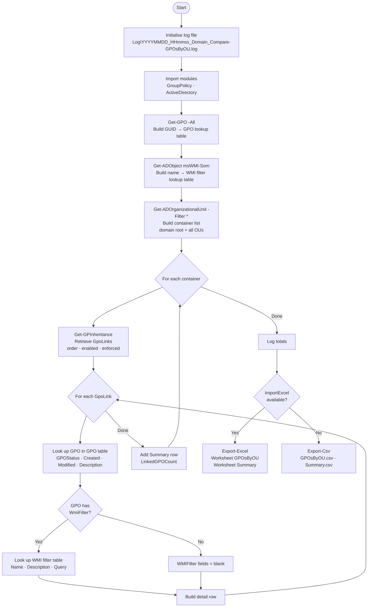

# Compare-GPOsByOU.ps1

Reports all Group Policy Objects linked to each Organizational Unit (and the domain
root), including **WMI filter name and WQL query**, to support side-by-side GPO
comparison and policy review across the domain.

## Synopsis

```powershell
.\Compare-GPOsByOU.ps1 [-Domain <string>] [-OutputPath <string>] [-IncludeAll]
```

## Parameters

| Parameter | Type | Required | Default | Description |
| --- | --- | --- | --- | --- |
| `Domain` | String | No | `$env:USERDNSDOMAIN` | FQDN of the AD domain to query |
| `OutputPath` | String | No | Script directory | Directory where the report is written |
| `IncludeAll` | Switch | No | — | Also include containers with no linked GPOs in the Summary worksheet |

## Output

| File | When | Description |
| --- | --- | --- |
| `YYYY-MM-dd_<Domain>_Compare-GPOsByOU.xlsx` | ImportExcel available | Two-worksheet workbook |
| `YYYY-MM-dd_<Domain>_Compare-GPOsByOU_GPOsByOU.csv` | Fallback | One row per GPO link per container |
| `YYYY-MM-dd_<Domain>_Compare-GPOsByOU_Summary.csv` | Fallback | One row per container with GPO count |
| `Log\YYYYMMDD_HHmmss_<Domain>_Compare-GPOsByOU.log` | Always | Timestamped run log |

### GPOsByOU worksheet columns

| Column | Description |
| --- | --- |
| `ContainerName` | Friendly name of the OU or domain root |
| `ContainerDN` | Full Distinguished Name of the container |
| `LinkOrder` | GPO link order (1 = highest precedence) |
| `LinkEnabled` | Whether this specific link is enabled |
| `LinkEnforced` | Whether this link is enforced (No Override) |
| `GPOName` | Display name of the GPO |
| `GPOId` | GUID in `{…}` notation |
| `GPOStatus` | `AllSettingsEnabled` / `UserSettingsDisabled` / `ComputerSettingsDisabled` / `AllSettingsDisabled` |
| `ComputerSettingsEnabled` | `True` when Computer Configuration is active |
| `UserSettingsEnabled` | `True` when User Configuration is active |
| `WMIFilterName` | Display name of the attached WMI filter (blank = none) |
| `WMIFilterDescription` | Description of the WMI filter |
| `WMIFilterQuery` | Full WQL query including namespace, e.g. `root\CIMv2;SELECT …` |
| `GPOCreationTime` | When the GPO was created |
| `GPOModificationTime` | When the GPO was last modified |
| `GPODescription` | GPO description field |

### Summary worksheet columns

| Column | Description |
| --- | --- |
| `ContainerName` | Friendly name of the OU or domain root |
| `ContainerDN` | Full Distinguished Name |
| `LinkedGPOCount` | Number of GPOs directly linked to this container |

## Requirements

| Requirement | Details |
| --- | --- |
| PowerShell | 5.1 or 7+ |
| RSAT — Group Policy | `GroupPolicy` module (`RSAT-GPMC`) |
| RSAT — Active Directory | `ActiveDirectory` module (`RSAT-AD-PowerShell`) |
| ImportExcel | Optional — [dfinke/ImportExcel](https://github.com/dfinke/ImportExcel). Falls back to CSV when not installed. |
| Permissions | Domain read + Group Policy Read on all GPOs + Read on `CN=SOM,CN=WMIPolicy,CN=System,<DomainDN>` for WMI filters |

Install RSAT features (elevated, Windows 10/11 / Server 2016+):

```powershell
Add-WindowsCapability -Online -Name 'Rsat.GroupPolicy.Management.Tools~~~~0.0.1.0'
Add-WindowsCapability -Online -Name 'Rsat.ActiveDirectory.DS-LDS.Tools~~~~0.0.1.0'
```

Install ImportExcel:

```powershell
Install-Module -Name ImportExcel -Scope CurrentUser
```

## Examples

### Run against the current user's domain

```powershell
.\Compare-GPOsByOU.ps1
```

### Run against a specific domain and write output to a custom folder

```powershell
.\Compare-GPOsByOU.ps1 -Domain contoso.com -OutputPath C:\Reports
```

### Include OUs with no linked GPOs in the Summary sheet

```powershell
.\Compare-GPOsByOU.ps1 -IncludeAll
```

## How it works

1. **GPO pre-load** — Calls `Get-GPO -All` and stores every GPO in a hashtable keyed
   by GUID for fast lookup.
2. **WMI filter pre-load** — Reads all `msWMI-Som` objects from
   `CN=SOM,CN=WMIPolicy,CN=System,<DomainDN>`. The `msWMI-Parm2` attribute holds
   the WMI namespace and WQL query separated by a semicolon. Results are stored in a
   hashtable keyed by filter display name (`msWMI-Name`).
3. **Container enumeration** — Retrieves the domain root and every OU via
   `Get-ADOrganizationalUnit -Filter *`.
4. **Link collection** — Calls `Get-GPInheritance` per container. This returns
   `GpoLinks` with accurate link order, enabled, and enforced flags — avoiding the
   manual parsing of the raw `gpLink` attribute (which encodes flags as bit fields
   and orders links right-to-left with no link numbers).
5. **WMI filter resolution** — For each linked GPO, reads `$gpo.WmiFilter.Name` and
   looks the name up in the pre-loaded WMI filter table to attach the description and
   WQL query.
6. **Export** — All rows are written to Excel (two worksheets with AutoFilter,
   AutoSize, and frozen header row) or to two CSV files when ImportExcel is
   unavailable.



## Notes

- WMI filter queries are stored in `msWMI-Parm2` in the format
  `<namespace>;<WQL query>`, e.g. `root\CIMv2;SELECT * FROM Win32_OperatingSystem WHERE ...`.
  The full string is written to `WMIFilterQuery` as-is.
- `Get-GPInheritance` is called once per container, which means one LDAP round-trip
  per OU. For large domains (hundreds of OUs) the script may take several minutes.
- If a GPO link references a deleted GPO (orphaned link), `GPOStatus` is set to
  `Unknown` and all GPO detail columns are blank; a warning is logged.
- If access to the WMI filter container is denied, all `WMIFilter*` columns are
  blank and a single warning is logged. All other data is still collected.

## Version history

| Version | Date | Author | Changes |
| --- | --- | --- | --- |
| 1.0.0 | 2026-07-02 | M. Stam | Initial release |
