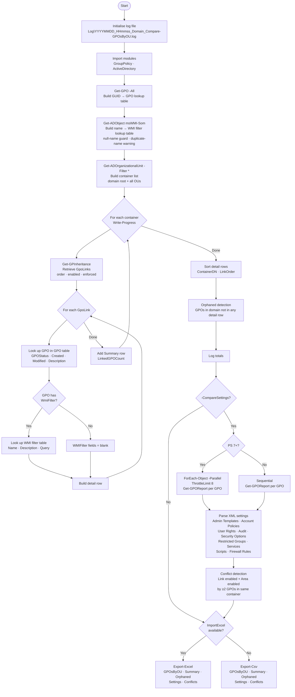

# Compare-GPOsByOU.ps1

Reports all Group Policy Objects linked to each Organizational Unit
(and the domain root), including **WMI filter name and WQL query**,
to support side-by-side GPO comparison and policy review across the
domain.

## Synopsis

```powershell
.\.Compare-GPOsByOU.ps1 [-Domain <string>] [-DomainController <string>]
                       [-OutputPath <string>] [-SearchBase <string>]
                       [-IncludeAll] [-CompareSettings] [-PassThru]
```

## Parameters

| Parameter | Type | Required | Default | Description |
| --- | --- | --- | --- | --- |
| `Domain` | String | No | `$env:USERDNSDOMAIN` | FQDN of the AD domain to query |
| `DomainController` | String | No | — (Windows selects) | FQDN or hostname of a specific DC; pins all AD and GP queries to one source to avoid replication-lag inconsistencies |
| `OutputPath` | String | No | Script directory | Directory where the report is written; created automatically if it does not exist |
| `SearchBase` | String | No | — (entire domain) | DN of the OU to use as the scan root; only that OU and its descendants are included |
| `IncludeAll` | Switch | No | — | Also include containers with no linked GPOs in the Summary worksheet |
| `CompareSettings` | Switch | No | — | Fetch the full GPO settings report for every linked GPO and add Settings and Conflicts worksheets |
| `PassThru` | Switch | No | — | Return collected data as a `[PSCustomObject]` to the pipeline (keys: `GPOsByOU`, `Summary`, `Orphaned`, `Settings`, `Conflicts`) |

## Output

| File | When | Description |
| --- | --- | --- |
| `YYYY-MM-dd_<Domain>_Compare-GPOsByOU.xlsx` | ImportExcel available | Up to six-worksheet workbook |
| `YYYY-MM-dd_<Domain>_Compare-GPOsByOU_GPOsByOU.csv` | Fallback | One row per GPO link per container |
| `YYYY-MM-dd_<Domain>_Compare-GPOsByOU_Summary.csv` | Fallback | One row per container with GPO count |
| `YYYY-MM-dd_<Domain>_Compare-GPOsByOU_Orphaned.csv` | Fallback | Domain GPOs not linked anywhere in the scanned scope |
| `YYYY-MM-dd_<Domain>_Compare-GPOsByOU_Settings.csv` | Fallback + `-CompareSettings` | One row per configured setting |
| `YYYY-MM-dd_<Domain>_Compare-GPOsByOU_Conflicts.csv` | Fallback + `-CompareSettings` | Conflicting settings only |
| `Log\YYYYMMDD_HHmmss_<Domain>_Compare-GPOsByOU.log` | Always | Timestamped run log |

### GPOsByOU worksheet columns

| Column | Description |
| --- | --- |
| `ContainerName` | Friendly name of the OU or domain root |
| `ContainerDN` | Full Distinguished Name of the container |
| `LinkOrder` | GPO link order (1 = highest precedence) |
| `LinkEnabled` | Whether this specific link is enabled |
| `LinkEnforced` | Whether this link is enforced (No Override) |
| `GPOName` | Display name of the GPO |
| `GPOId` | GUID in `{…}` notation |
| `GPOStatus` | `AllSettingsEnabled` / `UserSettingsDisabled` / `ComputerSettingsDisabled` / `AllSettingsDisabled` |
| `ComputerSettingsEnabled` | `True` when Computer Configuration is active |
| `UserSettingsEnabled` | `True` when User Configuration is active |
| `WMIFilterName` | Display name of the attached WMI filter (blank = none) |
| `WMIFilterDescription` | Description of the WMI filter |
| `WMIFilterQuery` | Full WQL query including namespace, e.g. `root\CIMv2;SELECT …` |
| `GPOCreationTime` | When the GPO was created |
| `GPOModificationTime` | When the GPO was last modified |
| `GPODescription` | GPO description field |

### Summary worksheet columns

| Column | Description |
| --- | --- |
| `ContainerName` | Friendly name of the OU or domain root |
| `ContainerDN` | Full Distinguished Name |
| `LinkedGPOCount` | Number of GPOs directly linked to this container |

### Orphaned worksheet columns

| Column | Description |
| --- | --- |
| `GPOName` | Display name of the unlinked GPO |
| `GPOId` | GUID in `{…}` notation |
| `GPOStatus` | `AllSettingsEnabled` / `UserSettingsDisabled` / `ComputerSettingsDisabled` / `AllSettingsDisabled` |
| `GPOCreationTime` | When the GPO was created |
| `GPOModificationTime` | When the GPO was last modified |
| `GPODescription` | GPO description field |

### Settings worksheet columns (`-CompareSettings`)

| Column | Description |
| --- | --- |
| `ContainerName` / `ContainerDN` | Container the GPO is linked to |
| `LinkOrder` | GPO link order at that container |
| `LinkEnabled` / `LinkEnforced` | Link state flags |
| `GPOName` | Display name of the GPO |
| `WMIFilterName` | Attached WMI filter (blank = none) |
| `ComputerSettingsEnabled` | Whether Computer Configuration is active on the GPO |
| `UserSettingsEnabled` | Whether User Configuration is active on the GPO |
| `Area` | `Computer` or `User` |
| `ExtensionType` | `Administrative Templates`, `Security Settings`, `Scripts`, or `Windows Firewall` |
| `Category` | Sub-category within the extension type |
| `SettingName` | Name of the configured setting |
| `SettingState` | State (e.g. `Enabled`, `Disabled`, `Configured`) |
| `SettingValue` | Configured value |

### Conflicts worksheet columns (`-CompareSettings`)

Same columns as Settings; contains only rows where the same `Area + SettingName` is
configured by two or more GPOs that are both **link-enabled** and have the relevant
half (Computer or User) **enabled on the GPO**, linked to the same container.

## Requirements

| Requirement | Details |
| --- | --- |
| PowerShell | 5.1 or 7+ |
| RSAT — Group Policy | `GroupPolicy` module (`RSAT-GPMC`) |
| RSAT — Active Directory | `ActiveDirectory` module (`RSAT-AD-PowerShell`) |
| ImportExcel | Optional — [dfinke/ImportExcel](https://github.com/dfinke/ImportExcel). Falls back to CSV when not installed. |
| Permissions | Domain read + Group Policy Read on all GPOs + Read on `CN=SOM,CN=WMIPolicy,CN=System,<DomainDN>` for WMI filters |

Install RSAT features (elevated, Windows 10/11 / Server 2016+):

```powershell
Add-WindowsCapability -Online -Name 'Rsat.GroupPolicy.Management.Tools~~~~0.0.1.0'
Add-WindowsCapability -Online -Name 'Rsat.ActiveDirectory.DS-LDS.Tools~~~~0.0.1.0'
```

Install ImportExcel:

```powershell
Install-Module -Name ImportExcel -Scope CurrentUser
```

## Examples

### Run against the current user's domain

```powershell
.\Compare-GPOsByOU.ps1
```

### Run against a specific domain and write output to a custom folder

```powershell
.\Compare-GPOsByOU.ps1 -Domain contoso.com -OutputPath C:\Reports
```

### Scope the scan to a specific OU subtree

```powershell
.\Compare-GPOsByOU.ps1 -SearchBase 'OU=Offices,DC=contoso,DC=com'
```

### Compare GPO settings and detect conflicts

```powershell
.\Compare-GPOsByOU.ps1 -CompareSettings
```

### Combine subtree scan with settings comparison

```powershell
.\Compare-GPOsByOU.ps1 -SearchBase 'OU=IT,DC=contoso,DC=com' -CompareSettings
```

### Include OUs with no linked GPOs in the Summary sheet

```powershell
.\Compare-GPOsByOU.ps1 -IncludeAll
```
### Pin queries to a specific domain controller

```powershell
.\.Compare-GPOsByOU.ps1 -Domain contoso.com -DomainController dc01.contoso.com
```

### Return results to the pipeline for further processing

```powershell
$data = .\.Compare-GPOsByOU.ps1 -PassThru
$data.Conflicts | Where-Object { $_.ExtensionType -eq 'Administrative Templates' }
```
## How it works

1. **GPO pre-load** — Calls `Get-GPO -All` and stores every GPO in a
   hashtable keyed by GUID for fast lookup.
2. **WMI filter pre-load** — Reads all `msWMI-Som` objects from
   `CN=SOM,CN=WMIPolicy,CN=System,<DomainDN>`. The `msWMI-Parm2`
   attribute holds the WMI namespace and WQL query. Filters with a missing
   display name are skipped with a warning; duplicate display names are also
   warned. Results are stored keyed by `msWMI-Name`.
3. **Container enumeration** — Retrieves the domain root and every OU via
   `Get-ADOrganizationalUnit -Filter *`. A `Write-Progress` bar shows
   real-time progress during the scan loop.
4. **Link collection** — Calls `Get-GPInheritance` per container. This returns
   `GpoLinks` with accurate link order, enabled, and enforced flags —
   avoiding the manual parsing of the raw `gpLink` attribute (which
   encodes flags as bit fields and orders links right-to-left).
5. **WMI filter resolution** — For each linked GPO, reads
   `$gpo.WmiFilter.Name` and looks it up in the pre-loaded WMI filter
   table. A null-name guard prevents errors when the filter object is
   present but its name attribute is missing.
6. **Sort & orphaned detection** — After the loop, detail rows are sorted
   by `ContainerDN, LinkOrder` for a consistent spreadsheet layout.
   GPOs present in the pre-loaded table but not referenced by any collected
   link are written to the **Orphaned** worksheet.
7. **Settings extraction** (only when `-CompareSettings` is specified) —
   Calls `Get-GPOReport -ReportType Xml` once per unique linked GPO and
   parses the XML using namespace-agnostic `local-name()` XPath queries.
   On **PowerShell 7+**, reports are fetched in parallel (up to 8 concurrent
   requests via `ForEach-Object -Parallel`); on PS 5.1 the fetch is sequential.
   Extracts the following setting types from both Computer and User sections:
   - **Administrative Templates** — every `<Policy>` element (name, state, category).
   - **Security Settings – Account Policies** — password, account lockout, and Kerberos policy values.
   - **Security Settings – User Rights Assignment** — right name and assigned members.
   - **Security Settings – Audit Policy** — subcategory name and value.
   - **Security Settings – Security Options** — registry-based policy settings (`<SecurityOptions>` nodes).
   - **Security Settings – Restricted Groups** — group name and member list.
   - **Security Settings – System Services** — service name and startup mode (`<NTService>` nodes).
   - **Scripts** — Startup, Shutdown, Logon, and Logoff script paths.
   - **Windows Firewall Rules** — name, profile, action, and active state from `<FirewallRules><Rule>` nodes.
8. **Conflict detection** — Groups the Settings rows by
   `ContainerDN + Area + SettingName`. A conflict is flagged only when
   the GPO link is enabled **and** the relevant half (Computer or User
   Configuration) is enabled on the GPO — preventing false positives from
   settings in disabled GPO halves.
9. **Export** — All rows are written to Excel (up to six worksheets with
   AutoFilter, AutoSize, and frozen header row) or to CSV files when
   ImportExcel is unavailable.


```mermaid
flowchart TD
    A([Start]) --> B[Initialise log file\nLog\YYYYMMDD_HHmmss_Domain_Compare-GPOsByOU.log]
    B --> C[Import modules\nGroupPolicy · ActiveDirectory]
    C --> D[Get-GPO -All\nBuild GUID → GPO lookup table]
    D --> E[Get-ADObject msWMI-Som\nBuild name → WMI filter lookup table\nnull-name guard · duplicate-name warning]
    E --> F[Get-ADOrganizationalUnit -Filter *\nBuild container list\ndomain root + all OUs]
    F --> G{For each container\nWrite-Progress}

    G --> H[Get-GPInheritance\nRetrieve GpoLinks\norder · enabled · enforced]
    H --> I{For each GpoLink}

    I --> J[Look up GPO in GPO table\nGPOStatus · Created · Modified · Description]
    J --> K{GPO has\nWmiFilter?}
    K -- Yes --> L[Look up WMI filter table\nName · Description · Query]
    K -- No --> M[WMIFilter fields = blank]
    L --> N[Build detail row]
    M --> N

    N --> I
    I -- Done --> O[Add Summary row\nLinkedGPOCount]
    O --> G

    G -- Done --> P[Sort detail rows\nContainerDN · LinkOrder]
    P --> Q[Orphaned detection\nGPOs in domain not in any detail row]
    Q --> R[Log totals]
    R --> S{-CompareSettings?}

    S -- No --> T{ImportExcel\navailable?}
    S -- Yes --> U{PS 7+?}
    U -- Yes --> V[ForEach-Object -Parallel\nThrottleLimit 8\nGet-GPOReport per GPO]
    U -- No --> W[Sequential\nGet-GPOReport per GPO]
    V --> X[Parse XML settings\nAdmin Templates · Account Policies\nUser Rights · Audit · Security Options\nRestricted Groups · Services\nScripts · Firewall Rules]
    W --> X
    X --> Y[Conflict detection\nLink enabled + Area enabled\nby ≥2 GPOs in same container]
    Y --> T

    T -- Yes --> Z[Export-Excel\nGPOsByOU · Summary · Orphaned\nSettings · Conflicts]
    T -- No --> AA[Export-Csv\nGPOsByOU · Summary · Orphaned\nSettings · Conflicts]
```

## Notes

- WMI filter queries are stored in `msWMI-Parm2` in the format
  `<namespace>;<WQL query>`, e.g.:
  `root\CIMv2;SELECT * FROM Win32_OperatingSystem WHERE ...`
  The full string is written to `WMIFilterQuery` as-is.
- `Get-GPInheritance` is called once per container — one LDAP round-trip
  per OU. For large domains (hundreds of OUs) the script may take
  several minutes. A `Write-Progress` bar shows real-time progress.
- If a GPO link references a deleted GPO (orphaned link), `GPOStatus` is set to
  `Unknown` and all GPO detail columns are blank; a warning is logged.
- If access to the WMI filter container is denied, all `WMIFilter*` columns are
  blank and a single warning is logged. All other data is still collected.
- **Orphaned GPO detection** is scoped to the containers actually scanned.
  When `-SearchBase` is used, a GPO linked only outside the subtree will
  appear in the Orphaned sheet even though it is linked elsewhere in the domain.
- **Parallel report fetching** (`-CompareSettings` on PS 7+) runs up to
  8 `Get-GPOReport` calls concurrently. Warnings from parallel runspaces
  appear on the warning stream but are not written to the log file.
- **`-DomainController`** should be specified in environments with many DCs
  or when running immediately after a GPO change, to ensure all queries are
  answered by the same replication source.

## Version history

| Version | Date | Author | Changes |
| --- | --- | --- | --- |
| 1.3.0 | 2026-07-10 | M. Stam | Added `-DomainController`, `-PassThru`; `Write-Progress`; orphaned GPO detection; Security Options, Restricted Groups, System Services, Windows Firewall rules in `-CompareSettings`; improved conflict detection (respects Computer/User area); parallel report fetching on PS 7+; WMI filter null guard; fixed double-logging; `OutputPath` auto-create; sort before export |
| 1.2.0 | 2026-07-07 | M. Stam | Added `-CompareSettings`: GPO settings extraction and conflict detection |
| 1.1.0 | 2026-07-07 | M. Stam | Added `-SearchBase` parameter to scope scanning to an OU subtree |
| 1.0.0 | 2026-07-02 | M. Stam | Initial release |
