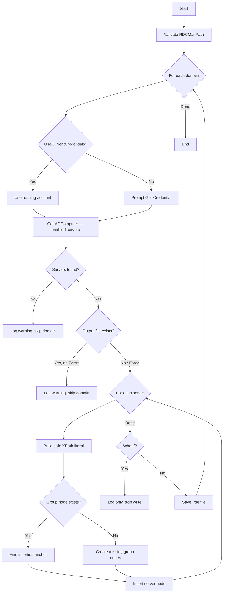

# Generate-RDCManConfigs.ps1

| | |
| --- | --- |
| **Version** | 2.0.0 |
| **Author** | Joey Eckelbarger |
| **Editor** | Marcel Stam |
| **Last modified** | 2026-06-17 |

## Synopsis

Generates RDCMan (`.rdg`) configuration files for each Active Directory domain.

## Description

Automates the creation of Remote Desktop Connection Manager configuration files for one or more AD domains. For each domain, the script:

1. Optionally prompts for credentials (skipped with `-UseCurrentCredentials`).
2. Queries all enabled Windows Server computer objects via `Get-ADComputer`.
3. Organises the servers into nested groups that mirror their OU/canonical-path structure.
4. Writes the result as a `.rdg` file readable by RDCMan 2.93+.

Existing `.rdg` files are **not** overwritten unless `-Force` is specified. All actions support `-WhatIf`. All output is logged to a timestamped file under `.\Log\`.

## Requirements

| Requirement | Detail |
| ----------- | ------ |
| PowerShell | 5.1 or 7+ |
| Module | `ActiveDirectory` (RSAT) |
| Permissions | Read access to the target AD domain(s) |

## Parameters

### `-RDCManPath` *(Mandatory)*

Directory where the generated `.rdg` files will be saved. Must already exist.

```text
Type    : String
Validate: Test-Path -PathType Container
```

### `-DomainNames` *(Mandatory)*

One or more domain FQDNs to query. Any domain controller within the domain is sufficient — pass the domain FQDN, not a specific DC hostname.

```text
Type    : String[]
Validate: NotNullOrEmpty
```

### `-UseCurrentCredentials`

When specified, uses the credentials of the running account for all AD queries. Skips the per-domain `Get-Credential` prompt. Suitable for scheduled or unattended execution.

```text
Type   : Switch
Default: $false
```

### `-Force`

Overwrites existing `.rdg` files. Without this switch, a domain whose output file already exists is skipped with a warning.

```text
Type   : Switch
Default: $false
```

### `-WhatIf`

Standard PowerShell dry-run switch. Shows what files would be saved without writing anything.

## Outputs

| Output | Path / Format |
| ------ | ------------- |
| RDCMan config | `<RDCManPath>\<domainName>.rdg` — one file per domain |
| Log file | `<ScriptRoot>\Log\yyyyMMdd_HHmmss.log` |

## Examples

### Single domain — interactive credentials

```powershell
.\Generate-RDCManConfigs.ps1 -RDCManPath C:\RDCConfigs -DomainNames contoso.com
```

### Multiple domains — interactive credentials

```powershell
.\Generate-RDCManConfigs.ps1 -RDCManPath C:\RDCConfigs -DomainNames contoso.com, fabrikam.com
```

A credential prompt appears for each domain before querying that domain.

### Unattended execution — current account, overwrite output

```powershell
.\Generate-RDCManConfigs.ps1 -RDCManPath C:\RDCConfigs -DomainNames contoso.com -UseCurrentCredentials -Force
```

### Dry run

```powershell
.\Generate-RDCManConfigs.ps1 -RDCManPath C:\RDCConfigs -DomainNames contoso.com -WhatIf
```

Shows what files would be saved without writing anything.

## How It Works



## XML Structure

Each generated `.rdg` file follows the RDCMan 2.93 schema. Servers are nested under group nodes that reflect their Active Directory canonical path.

```text
RDCMan
└── file (name = domain FQDN)
    └── group (OU level 1)
        └── group (OU level 2)
            └── server (FQDN + display name)
```

## Error Handling

| Scenario | Behaviour |
| -------- | --------- |
| `RDCManPath` does not exist | Validation fails immediately; script does not run |
| AD query fails for a domain | Error logged; domain skipped; remaining domains continue |
| No servers found in a domain | Warning logged; domain skipped |
| Output file already exists | Warning logged; domain skipped unless `-Force` is specified |
| Save fails for an `.rdg` file | Error logged; script continues |

## Internal Helpers

| Function | Purpose |
| -------- | ------- |
| `Write-ScriptLog` | Writes a timestamped entry to both the console and the log file |
| `ConvertTo-XPathLiteral` | Converts an OU name to a safe XPath 1.0 string literal, handling embedded single and double quotes via `concat()` |
| `ConvertTo-RDCGroupNode` | Returns a fresh `<group>` XML node imported into the target document — avoids mutating a shared template |
| `ConvertTo-RDCServerNode` | Returns a fresh `<server>` XML node imported into the target document |

## Version History

| Version | Date | Author | Change |
| ------- | ---- | ------ | ------ |
| 1.0.0 | — | Joey Eckelbarger | Initial release |
| 2.0.0 | 2026-06-17 | Marcel Stam | Added `param` block with `ValidateScript`; fixed `-Credential` not being passed to `Get-ADComputer`; added `-UseCurrentCredentials`, `-Force`, `SupportsShouldProcess`/`-WhatIf`; `try/catch` on all external calls; `Write-ScriptLog` to `.\Log\`; XPath injection protection; replaced shared mutable XML templates with fresh-node helpers; merged OU-tagging loop into XML-building loop; `Join-Path` for all paths; removed `Select` alias and dead variables |
