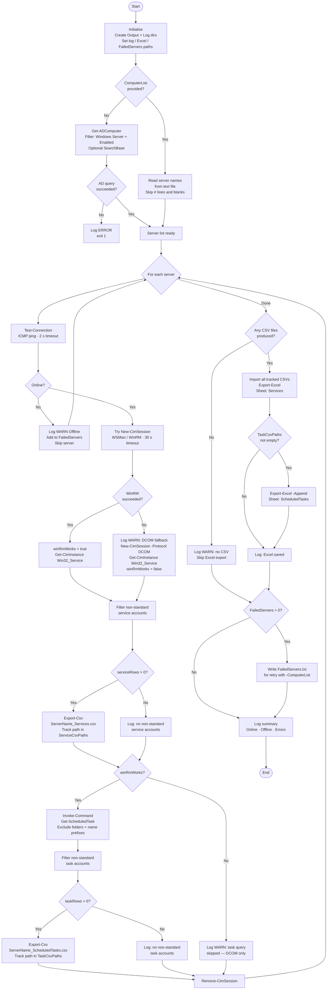

# Get-ServiceAccounts

## Version

| Field   | Value           |
|---------|-----------------|
| Version | 1.7             |
| Date    | 2026-06-10      |
| Author  | M. Stam         |

## Description

Scans all enabled Windows Server objects in Active Directory for **non-standard accounts** used by Windows services and scheduled tasks. The following built-in accounts are excluded from the results:

- `LocalSystem` (bare name without domain prefix)
- Any account prefixed with `NT AUTHORITY\` (covers `LocalSystem`, `LocalService`, `NetworkService`, etc.)
- Any account prefixed with `NT SERVICE\`
- Well-known SIDs `S-1-5-18`, `S-1-5-19`, `S-1-5-20`
- Empty or null identities

For each server the script:

1. Checks reachability with `Test-Connection` (ICMP ping, 2-second timeout per host).
2. Opens a CIM session (WSMan/WinRM preferred, DCOM fallback; 30-second operation timeout) and queries `Win32_Service`.
3. If WinRM is available, also queries scheduled tasks remotely via `Invoke-Command` / `Get-ScheduledTask`.
4. Scheduled tasks in excluded folders (`Microsoft`, `GoogleSystem`) and tasks matching excluded name prefixes are filtered out before transmission.
5. Exports service accounts to `<ServerName>_Services.csv` and task accounts to `<ServerName>_ScheduledTasks.csv` in `.\Output\`.
6. Logs all activity to a timestamped file in `.\Log\`.

## Script Flow



## Parameters

| Parameter      | Type   | Mandatory | Default                | Description                                                         |
|----------------|--------|-----------|------------------------|---------------------------------------------------------------------|
| `SearchBase`   | String | No        | Entire domain          | Distinguished name of the OU to search for server objects.          |
| `ComputerList` | String | No        | —                      | Path to a text file (one server per line) to scan instead of AD. ¹  |
| `OutputFolder` | String | No        | `$PSScriptRoot\Output` | Folder where per-server CSV files are written.                      |
| `LogFolder`    | String | No        | `$PSScriptRoot\Log`    | Folder where the timestamped log file is written.                   |
| `PingCount`    | Int    | No        | `1`                    | Number of ICMP echo requests used to test reachability (range 1–5). |

> ¹ Lines starting with `#` and blank lines are ignored. Use the `_FailedServers.txt` produced by a previous run to retry only the failed hosts.

## Output

| File                                                       | Description                                                          |
|------------------------------------------------------------|----------------------------------------------------------------------|
| `.\Output\<ServerName>_Services.csv`                       | Per-server services running under a non-standard account.            |
| `.\Output\<ServerName>_ScheduledTasks.csv`                 | Per-server scheduled tasks running under a non-standard account.     |
| `.\Output\<yyyyMMdd_HHmmss>_ServiceAccounts.xlsx`          | Combined workbook: **Services** and **ScheduledTasks** sheets.       |
| `.\Output\<yyyyMMdd_HHmmss>_FailedServers.txt`             | Offline + error servers for retry (only written if failures).        |
| `.\Log\<yyyyMMdd_HHmmss>_Get-ServiceAccounts.log`          | Full activity log with timestamps and severity levels.               |

### CSV columns

`Server`, `FQDN`, `Type`, `Name`, `DisplayName`, `StartName`, `State`, `StartMode`, `PathName`

> `Type` is always `Service` in `_Services.csv` and always `ScheduledTask` in `_ScheduledTasks.csv`.
> For scheduled tasks, `StartMode` contains the logon type and `PathName` is empty.

### Scheduled task exclusions

The following tasks are filtered out **on the remote server** before results are returned:

| Exclusion type | Values                                                                                    |
|----------------|-------------------------------------------------------------------------------------------|
| Task folders   | `Microsoft`, `GoogleSystem`                                                               |
| Name prefixes  | `User_Feed_Synchronization*`, `MicrosoftEdgeUpdate*`, `OneDrive Reporting Task*`          |

## Requirements

- PowerShell 5.1 or 7+
- RSAT module `ActiveDirectory`
- Module `ImportExcel` (`Install-Module ImportExcel`)
- WMI/CIM access to target servers (WinRM preferred; DCOM fallback)
- WinRM / PSRemoting enabled on target servers for scheduled task enumeration
- Account with read access to AD and remote WMI/WinRM on all servers

## Examples

```powershell
# Scan all servers in the domain
.\Get-ServiceAccounts.ps1

# Scan only servers in a specific OU
.\Get-ServiceAccounts.ps1 -SearchBase "OU=Servers,DC=tbi,DC=nl"

# Retry only failed servers from a previous run
.\Get-ServiceAccounts.ps1 -ComputerList ".\Output\20260608_120000_FailedServers.txt"
```

## Notes

- Offline or unreachable servers are logged with `[WARN]` and skipped.
- CIM sessions are always cleaned up after each server (including the interim WSMan session when falling back to DCOM). Both WSMan and DCOM sessions use a 30-second `-OperationTimeoutSec` to prevent hangs on unresponsive hosts.
- `Test-Connection -TimeoutSeconds` requires **PowerShell 6.1 or later**. On PowerShell 5.1 this parameter does not exist and the script must be run from PowerShell 7+ for per-host timeout control.
- A `Write-Progress` bar shows the current server and completion percentage during the scan.
- `Export-Csv` uses `-Encoding UTF8`; on PowerShell 5.1 this writes a BOM — switch to `UTF8NoBOM` on PS 7+ if BOM-free output is required.
- `$servers.Count` in the summary is wrapped with `@()` to handle `$null` or single-object results from `Get-ADComputer`.
- Scheduled task enumeration requires WinRM; servers reachable only via DCOM will have tasks skipped with a `[WARN]` entry.
- Scheduled task exclusions (folders and name prefixes) are applied inside the remote script block to minimise network traffic.
- Per-server CSVs written during the current run are tracked in memory; the Excel export uses only those paths, preventing pollution from previous runs.
- Run from a host with network access to all target servers and sufficient AD read permissions.

## Version History

| Version | Date       | Author  | Change                                                                    |
|---------|------------|---------|---------------------------------------------------------------------------|
| 1.0     | 2026-06-08 | M. Stam | Initial version                                                           |
| 1.1     | 2026-06-08 | M. Stam | Added `-ComputerList` parameter and `_FailedServers.txt` export           |
| 1.2     | 2026-06-08 | M. Stam | Combined per-server CSVs into a single Excel workbook at run end          |
| 1.3     | 2026-06-08 | M. Stam | Added scheduled task enumeration via PSRemoting; added `Type` column      |
| 1.4     | 2026-06-08 | M. Stam | Split services and tasks into separate CSVs and Excel sheets              |
| 1.5     | 2026-06-08 | M. Stam | Added scheduled task folder and name-prefix exclusions                    |
| 1.6     | 2026-06-10 | M. Stam | Bug fixes: Excel `-Append`, CimSession, CSV tracking, logging, validation |
| 1.7     | 2026-06-10 | M. Stam | Robustness: ping/CIM timeouts, progress bar, `@()` guard, UTF8 note       |
