# Create-ServiceNow-User

## Synopsis

Creates a Windows-authenticated SQL Server login and database user for the
local machine account `<MachineName>\servicenow`.

## Description

This script provisions the ServiceNow integration account on a SQL Server
instance. It dynamically derives the machine name from `SERVERPROPERTY('MachineName')`,
so no manual substitution of server names is required.

The account is created in two databases:

| Database | Purpose |
| --- | --- |
| `master` | Server-level login and user for general connectivity |
| `msdb` | User for SQL Agent / maintenance plan visibility |

## Prerequisites

- The Windows local account `<MachineName>\servicenow` must exist on the host
  **before** this script is run.
- The executing account must hold at minimum:
  - `securityadmin` fixed server role (to create logins), **and**
  - `db_accessadmin` in `master` and `msdb` (to create users), **or**
  - `sysadmin` fixed server role.

## Usage

Execute against each SQL Server instance where ServiceNow discovery or
integration is required. The script does **not** loop over multiple instances
automatically; run it once per instance from SSMS or `sqlcmd`.

```text
-- Using sqlcmd (replace SERVER\INSTANCE and adjust -E / -U/-P as needed)
sqlcmd -S SERVER\INSTANCE -E -i Create-ServiceNow-User.sql
```

## What the Script Does

1. Switches to the `master` database.
2. Reads the machine name via `SERVERPROPERTY('MachineName')`.
3. Creates the Windows login `<MachineName>\servicenow` with `master` as the
   default database.
4. Creates a database user for that login in `master` with default schema `dbo`.
5. Switches to the `msdb` database.
6. Creates a database user for the same login in `msdb` with default schema `dbo`.

## Script Flow

```mermaid
flowchart TD
    A(["START"]) --> B["USE master database"]
    B --> C["DECLARE @server_name, @sql variables"]
    C --> D[["sp_executesql: SERVERPROPERTY('MachineName')"]]
    D --> E[/"PRINT @server_name"/]

    E --> F["Build CREATE LOGIN statement\n@server_name + '\\servicenow'"]
    F --> G[["sp_executesql: CREATE LOGIN\n[machine\\servicenow] FROM WINDOWS\nDEFAULT_DATABASE = master"]]

    G --> H["Build CREATE USER statement\nfor master db"]
    H --> I[["sp_executesql: CREATE USER\n[machine\\servicenow]\nFOR LOGIN [machine\\servicenow]"]]

    I --> J["Build ALTER USER statement"]
    J --> K[["sp_executesql: ALTER USER\n[machine\\servicenow]\nWITH DEFAULT_SCHEMA = dbo"]]

    K --> L["GO — batch boundary"]

    L --> M["USE msdb database"]
    M --> N["DECLARE @server_name, @sql variables"]
    N --> O[["sp_executesql: SERVERPROPERTY('MachineName')"]]

    O --> P["Build CREATE USER statement\nfor msdb db"]
    P --> Q[["sp_executesql: CREATE USER\n[machine\\servicenow]\nFOR LOGIN [machine\\servicenow]"]]

    Q --> R["Build ALTER USER statement"]
    R --> S[["sp_executesql: ALTER USER\n[machine\\servicenow]\nWITH DEFAULT_SCHEMA = dbo"]]

    S --> T["GO — batch boundary"]
    T --> U(["END"])

    subgraph batch1 ["Batch 1 — master database scope"]
        B
        C
        D
        E
        F
        G
        H
        I
        J
        K
    end

    subgraph batch2 ["Batch 2 — msdb database scope"]
        M
        N
        O
        P
        Q
        R
        S
    end
```



## Notes

- Named instances each have their own independent login/user store; run the
  script separately against every instance (e.g. `SERVER\INST1`, `SERVER\INST2`).
- The `DEFAULT_SCHEMA` is set to `dbo` in both databases.
- No roles or permissions beyond basic user creation are granted by this script;
  grant additional rights separately as required by the ServiceNow integration.

## Version History

| Version | Date | Author | Change |
| --- | --- | --- | --- |
| 1.0 | 2026-06-19 | M. Stam | Initial version |
